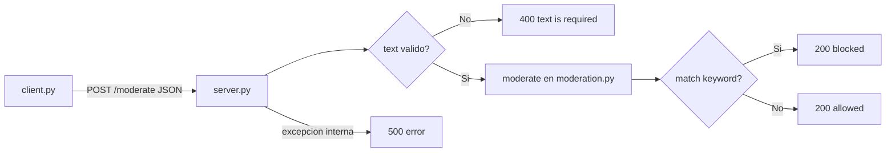

# Arquitectura

El sistema tiene dos ejecutables independientes que se comunican por HTTP/JSON,
más un módulo de lógica compartido y un archivo de configuración.

## Componentes

| Componente      | Tipo        | Responsabilidad                                     |
| --------------- | ----------- | --------------------------------------------------- |
| `server.py`     | Proceso     | Servidor HTTP (`http.server`). Recibe POST, valida y responde. |
| `client.py`     | CLI         | Arma el POST, aplica timeout y formatea la salida.  |
| `moderation.py` | Módulo      | Carga `config.yml` y decide `allowed`/`blocked`.    |
| `config.yml`    | Config      | Host, puerto, timeout, umbrales y keywords.         |

Tanto `server.py` como `client.py` importan `moderation.py`: el server para
moderar, el client solo para leer el timeout desde `config.yml`.

## Flujo de una request

Recorrido de un `POST /moderate` desde el cliente hasta la respuesta.

## Decisiones de diseño

- **Solo stdlib**: el server usa `http.server.ThreadingHTTPServer` y el client
  `urllib`. No requiere instalar dependencias. Ver [librerias.md](librerias.md).
- **Config única fuente de verdad**: ningún valor ajustable está hardcodeado;
  todo vive en `config.yml`. Ver [modulos.md](modulos.md) y la sección de config.
- **Sin acoplar a la red**: `host` y `port` del server, e `IP:puerto` del client,
  son siempre parámetros/config, nunca literales en el código.
